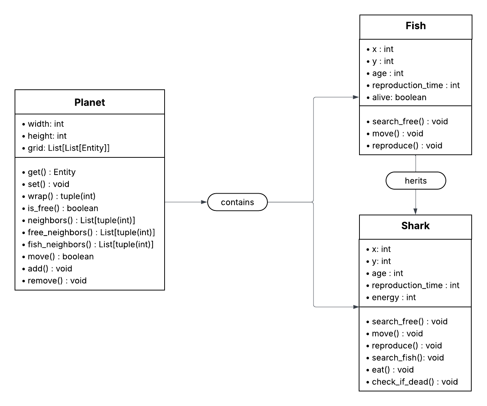

# Wa-Tor project

Wa-Tor is an ecological simulation that models the interactions between two species—fish and sharks—within a toroidal ocean world. The project illustrates predator–prey dynamics through simple rules of movement, reproduction, and survival, allowing emergent behaviors to appear from basic agent-based interactions.

## Requirements

For the "Pygame" user interface library to work, you must launch the project with Python <b>3.12.</b>

# Windows Setup Guide

1. Get Python 3.12 : <a href="https://www.python.org/ftp/python/3.12.10/python-3.12.10-amd64.exe">Windows installer (direct link)</a>
2. Go to the root of the project and create a new environment based on the 3.12 Python version :
`py -3.12 -m venv .venv`
3. Select the 3.12 version in your IDE (generally at bottom right for VSCode or IntelliJ)
4. (Optional) Execute this command to allow scripts execution in PowerShell `Set-ExecutionPolicy Unrestricted -Scope Process`
5. Activate the environment : `.\.venv\Scripts\Activate`
6. Check the Python version : `python --version`
7. Install the required modules : `pip install -r requirements.txt`

You should have now your environment specified in your CLI in parentheses.

# macOS Setup Guide

## Installation Steps

### 1. Install Python 3.12

Download and install Python 3.12 from the official website: [Python 3.12 macOS installer](https://www.python.org/downloads/)

### 2. Create a Virtual Environment

Navigate to the root of your project and create a virtual environment using Python 3.12:

```bash
python3.12 -m venv .venv
```

### 3. Select the Python Interpreter

Select the 3.12 interpreter in your IDE:
- **VSCode**: Bottom-right corner
- **IntelliJ/PyCharm**: Project Interpreter settings

### 4. Activate the Virtual Environment

```bash
source .venv/bin/activate
```

### 5. Verify Python Version

Check that you're using the correct Python version:

```bash
python --version
```

### 6. Install Dependencies

Install the required modules from the requirements file:

```bash
pip install -r requirements.txt
```

### 7. Confirmation

You should now see the environment name displayed in your terminal in parentheses (e.g., `(.venv)`), indicating that the virtual environment is active.

## Run the project

1. Ensure your <b>3.12</b> python environment is activated : `.\.venv\Scripts\Activate`
2. Execute the `main.py` file : `python .\src\main.py`

## Simulation parameters

The `.\src\config.py` file contains the following parameters :

- `grid_width` - The width of the grid
- `grid_height` The height of the grid
- `number_sharks` The number of Sharks in the simulation
- `fish_reproduction` The reproduction time of the fish
- `shark_reproduction` The reproduction time of the shark
- `shark_energy` The energy of the shark
- `shark_energy_gain` The gain given to the shark for each fish eaten

These parameters can be modified to influence the simulation and are used in these modules:
- Fish 
- Shark
- GUI
- Simulation

## Diagram



## Contributors

| Name        | Scope                               |                                        
|:------------|:------------------------------------|
| **Dylan**   | Planet, Grid management, Unit tests |
| **Fatima**  | Fish, Simulation, GUI               |
| **Flora**   | Shark, Simulation, Database         |
| **Umberto** | Readme, Documentation               |
